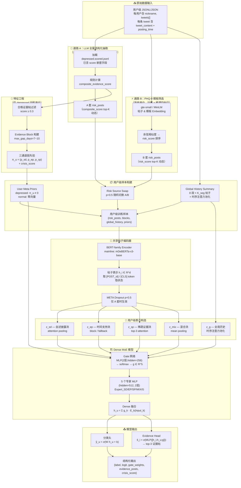
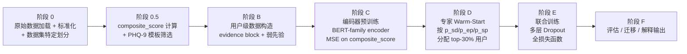
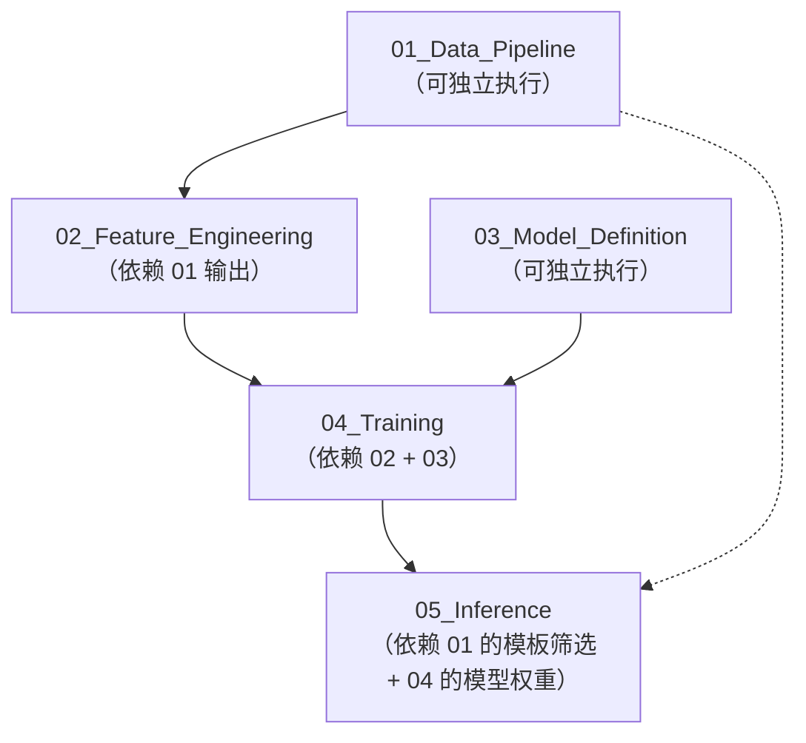
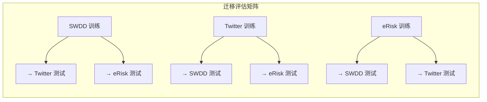

# 00 — 总控文件：社交媒体抑郁检测系统

> **系统代号**：WPG-MoE（Weak-Prior-Guided Dense Mixture-of-Experts）  
> **核心范式**：LUPI（Learning Using Privileged Information）— 训练用 LLM 特权信息，推理仅用模板筛选  
> **本文件**是整个工程的统筹大脑，定义系统架构、模块划分、全局数据流与子 Agent 职责。

---

## 1. 系统架构总览



---

## 1.1 Backbone 选择结论

> **结论**：对当前 WPG-MoE 任务与流程，主线 backbone 更推荐 **encoder-only 的 BERT 系列**，而不是 `Qwen3.5-2B` 这类小型 causal LM。

| 比较维度 | BERT 系列（推荐） | Qwen3.5-2B（保留为对照） | 结论 |
|---|---|---|---|
| 任务匹配 | 更适合帖子级判别表示学习、回归、分类 | 生成能力更强，但此流程几乎不用生成 | BERT 更匹配 |
| 对当前监督信号的适配 | 阶段 C 是 `composite_evidence_score` 回归，阶段 E 是分类 + 证据打分 | 可用，但生成式预训练优势未被充分使用 | BERT 更高效 |
| 推理代价 | 更低显存、更低时延，可扩大 batch 或保留更多 risk_posts | 2B causal LM 编码开销更高 | BERT 更优 |
| 与当前输入格式兼容性 | 可继续保留 `[POST_xx]` / `[META]` 设计 | 原方案天然兼容 | 二者都兼容 |
| 跨数据集语言适配 | 可统一为多语言 encoder，适合中文训练 → 英文测试 | 可做跨语种，但 2B causal LM 成本更高 | BERT 更灵活 |

**推荐主线**：
- 统一主线 backbone：`microsoft/mdeberta-v3-base`
- `hfl/chinese-macbert-base`、`microsoft/deberta-v3-base`、`hfl/chinese-roberta-wwm-ext` 保留为可选单语对照 / 上界实验
- `Qwen3.5-2B` 保留为可选对照实验或解释生成辅助模型，不再作为主线帖子编码器

---

## 2. 模块划分与子 Agent 职责

本系统拆分为 **5 个子 Agent**，各自对应一个 `.md` 执行文件：

| Agent | 执行文件 | 职责 | 输入 | 输出 |
|---|---|---|---|---|
| **数据管线** | `01_Data_Pipeline.md` | 原始数据标准化 + composite 计算 + PHQ-9 模板筛选 | 原始 scored/cleaned JSONL | `all_users_standardized.jsonl` + `depressed_scored_posts.jsonl` + A/B 双套 risk_posts + 数据划分 |
| **特征工程** | `02_Feature_Engineering.md` | evidence block 构建 + 弱先验计算 + 用户级样本组装 | `01` 的标准化产物 + A/B 双套 risk_posts | 用户级训练样本 JSONL |
| **模型定义** | `03_Model_Definition.md` | 编码器 + MoE + 门控 + Evidence Head 的 PyTorch 实现 | — | 可实例化的模型类 |
| **训练流程** | `04_Training.md` | 多阶段训练 + 跨数据集迁移评估 | 用户级样本 + 模型类 | 训练好的权重 + 评估报告 |
| **推理部署** | `05_Inference.md` | 端到端推理 pipeline + 解释生成 | 新用户帖子 + 模型权重 | 结构化预测 + 证据帖子 |

---

## 3. 全局数据结构定义

### 3.0 原始数据格式（实际磁盘文件）

> **重要**：这一节只描述磁盘上的真实 schema；任何类型纠正和字段重命名都在 `raw_loader.py` 中完成。当前仓库的 6 个目标数据文件全部是**用户级 JSONL**，每行一个用户对象。

**Depressed 用户（scored JSONL）** — 每行一个用户：
```json
{
  "nickname": "用户昵称",
  "label": "1",
  "gender": "男 / 女 / None",
  "tweets": [
    {
      "tweet_content": "帖子正文",
      "posting_time": "2024-01-15 14:30:22",
      "tweet_is_original": "True",
      "score": {
        "symptom_vector": { "depressed_mood": 0, "...9维": 0 },
        "first_person": true,
        "literal_self_evidence": true,
        "confidence": 0.0,
        "crisis_level": 0,
        "duration": { "has_hint": false, "hint_span_days": null },
        "functional_impairment": 0,
        "clinical_context": { "disease_mention_type": "none", "anchor_types": [] },
        "temporality": "current"
      }
    }
  ]
}
```

**Control/Normal 用户（cleaned JSONL）** — 也是真实 JSONL，对象流而不是 JSON array，且无 `score` 字段：
```json
{
  "nickname": "用户昵称",
  "label": "0",
  "gender": "男 / 女 / None",
  "tweets": [
    {
      "tweet_content": "帖子正文",
      "posting_time": "2024-01-15 14:30:22",
      "tweet_is_original": "True"
    }
  ]
}
```

### 3.0.1 标准化规则（`raw_loader.py` 执行）

| 原始字段 | 原始类型 | 内部字段 | 内部类型 | 规则 |
|---|---|---|---|---|
| `nickname` | `str` | `user_id` | `str` | 原样保留 |
| `label` | `str` (`"0"` / `"1"`) | `label` | `int` | `int(raw["label"])` |
| `gender` | `str`（含 `"None"`） | `gender` | `Optional[str]` | `"None"` / `""` / `null` 统一记为 `None` |
| `tweet_content` | `str` | `text` | `str` | 原样保留 |
| `posting_time` | `str` | `posting_time` | `str` | 原样保留，后续按需解析时间 |
| `tweet_is_original` | `str` / `bool` | `tweet_is_original` | `bool` | 布尔归一化 |
| `tweets[i]` 的索引 | `int` | `post_id` | `str` | 合成为 `f"{user_id}__{idx}"` |
| `score.*` | `dict` | 顶层字段 | 多种类型 | 展平嵌套，如 `score.confidence -> confidence` |

### 3.1 帖子级 Schema（内部统一格式，经 raw_loader 转换后）

```json
{
  "post_id": "string (合成: user_id__idx)",
  "user_id": "string (来自 nickname)",
  "text": "string (来自 tweet_content)",
  "posting_time": "datetime string",
  "tweet_is_original": true,
  "first_person": true,
  "literal_self_evidence": true,
  "symptom_vector": {
    "depressed_mood": 0,
    "anhedonia": 0,
    "sleep": 0,
    "fatigue": 0,
    "appetite_or_weight": 0,
    "worthlessness_or_guilt": 0,
    "concentration": 0,
    "psychomotor": 0,
    "suicidal_ideation": 0
  },
  "crisis_level": 0,
  "duration": {
    "has_hint": false,
    "hint_span_days": null
  },
  "functional_impairment": 0,
  "clinical_context": {
    "disease_mention_type": "none | current_self_claim | past_self_claim | other_person | general",
    "anchor_types": []
  },
  "temporality": "current | past | recovery | unclear",
  "confidence": 0.0,
  "composite_evidence_score": 0.0
}
```

### 3.2 模板筛选 risk_post Schema

```json
{
  "post_id": "string (标准化后 user_id__idx)",
  "text": "string",
  "risk_score": 0.0,
  "matched_dimensions": ["depressed_mood", "sleep"],
  "dim_scores": {
    "depressed_mood": 0.82,
    "anhedonia": 0.45,
    "sleep": 0.73,
    "fatigue": 0.31,
    "appetite_or_weight": 0.22,
    "worthlessness_or_guilt": 0.56,
    "concentration": 0.18,
    "psychomotor": 0.14,
    "suicidal_ideation": 0.09
  }
}
```

### 3.3 Evidence Block Schema

```json
{
  "block_id": 0,
  "post_ids": ["user_001__3", "user_001__7", "user_001__12"],
  "block_post_count": 3,
  "block_span_days": 8,
  "symptom_category_count": 4,
  "repeated_days": 3,
  "duration_support": true,
  "functional_impairment_max": 2,
  "crisis_max": 1,
  "clinical_anchor_count": 2,
  "avg_confidence": 0.78,
  "block_score": 0.65
}
```

### 3.4 用户级训练样本 Schema

```json
{
  "user_id": "string",
  "label": 1,
  "priors": {
    "self_disclosure": 0.71,
    "episode_supported": 0.42,
    "sparse_evidence": 0.18
  },
  "crisis_score": 2,
  "risk_posts_llm": [
    {
      "post_id": "user_001__3",
      "text": "...",
      "composite_evidence_score": 0.67,
      "crisis_level": 2,
      "temporality": "current"
    }
  ],
  "risk_posts_template": [
    { "post_id": "user_001__3", "text": "...", "risk_score": 0.82, "matched_dimensions": ["depressed_mood"] }
  ],
  "episode_blocks": [],
  "global_history_posts": [],
  "global_stats": {
    "total_posts": 146,
    "eligible_evidence_posts": 8,
    "posting_freq": 0.42,
    "active_span_days": 348
  }
}
```

> **Normal 用户**的样本结构相同，但 `label=0`、`priors` 全零、`crisis_score=0`、`risk_posts_llm` 为空、`episode_blocks` 为空。
>
> **验证/测试集中的 depressed 用户**也使用“推理兼容格式”，但 **`label` 保持为 `1`**：仅保留 B 套 `risk_posts`，`priors` 全零，`crisis_score=0`，`episode_blocks` 为空。

### 3.5 模型输出 Schema

```json
{
  "user_id": "string",
  "label": 1,
  "depressed_logit": 0.91,
  "gate_weights": [0.12, 0.41, 0.09, 0.18, 0.20],
  "dominant_channel": "episode_supported",
  "evidence_post_ids": ["user_001__3", "user_001__7", "user_001__1"],
  "evidence_scores": [0.93, 0.88, 0.74],
  "crisis_score": 2
}
```

---

## 4. 文件树结构

```
project_root/
├── agent执行文件夹/
│   ├── 00_Main_Orchestrator.md          # 本文件（总控）
│   ├── 01_Data_Pipeline.md              # 数据管线 Agent
│   ├── 02_Feature_Engineering.md        # 特征工程 Agent
│   ├── 03_Model_Definition.md           # 模型定义 Agent
│   ├── 04_Training.md                   # 训练流程 Agent
│   └── 05_Inference.md                  # 推理部署 Agent
│
├── src/
│   ├── data/
│   │   ├── __init__.py
│   │   ├── raw_loader.py                # 原始数据加载 + 格式转换 + 数据划分
│   │   ├── llm_extractor.py             # LLM 结构化抽取（已完成，仅保留参考）
│   │   ├── template_screener.py         # PHQ-9 模板筛选（通路 B）
│   │   └── composite_scorer.py          # composite_evidence_score 规则计算
│   │
│   ├── features/
│   │   ├── __init__.py
│   │   ├── evidence_block.py            # evidence block 构建
│   │   ├── weak_priors.py               # p_sd / p_ep / p_sp / crisis 计算
│   │   ├── user_sample_builder.py       # 用户级训练样本组装
│   │   └── global_history.py            # global_history_summary 构建
│   │
│   ├── model/
│   │   ├── __init__.py
│   │   ├── post_encoder.py              # BERT-family 帖子编码器
│   │   ├── user_representation.py       # 5 路用户级表示构造
│   │   ├── gate_network.py              # 门控网络
│   │   ├── expert_network.py            # 5 个专家 MLP
│   │   ├── moe_head.py                  # Dense MoE 融合 + 分类头
│   │   ├── evidence_head.py             # Evidence Head
│   │   └── full_model.py                # 完整模型封装
│   │
│   ├── training/
│   │   ├── __init__.py
│   │   ├── dataset.py                   # 用户级 Dataset（含多层 Dropout）
│   │   ├── losses.py                    # L_cls / L_route / L_evidence / L_balance / L_entropy
│   │   ├── encoder_pretrain.py          # 阶段 C：编码器预训练
│   │   ├── warm_start.py               # 阶段 D：专家 warm-start
│   │   ├── joint_trainer.py             # 阶段 E：联合训练主循环
│   │   ├── scheduler.py                 # 学习率调度 + L_entropy cosine decay
│   │   └── transfer_eval.py             # 跨数据集迁移评估
│   │
│   ├── inference/
│   │   ├── __init__.py
│   │   ├── pipeline.py                  # 端到端推理 pipeline
│   │   └── explanation.py               # LLM 解释生成（后处理）
│   │
│   └── utils/
│       ├── __init__.py
│       ├── config.py                    # 全局超参数配置
│       └── io_utils.py                  # JSONL 读写、路径管理
│
├── configs/
│   ├── default.yaml                     # 默认超参数
│   ├── swdd.yaml                        # SWDD（微博）数据集配置
│   ├── twitter.yaml                     # Twitter 数据集配置
│   └── erisk.yaml                       # eRisk 数据集配置
│
├── scripts/
│   ├── run_template_screening.py        # 执行 PHQ-9 模板筛选
│   ├── build_user_samples.py            # 构建用户级训练样本
│   ├── train.py                         # 完整训练入口
│   ├── transfer_eval.py                 # 跨数据集迁移评估入口
│   └── infer.py                         # 推理入口
│
├── dataset/                             # 原始磁盘数据（用户级 JSONL）
│   ├── weibo/
│   ├── twitter/
│   └── eRisk25/
└── data/
    ├── processed/
    │   └── <dataset>/
    │       ├── all_users_standardized.jsonl
    │       ├── depressed_scored_posts.jsonl
    │       ├── risk_posts_a.json
    │       ├── risk_posts_b.json
    │       └── splits.json
    ├── user_samples/                    # 用户级训练/验证/测试样本
    └── models/                          # 训练好的模型权重
```

---

## 5. 训练阶段流转图



> **注意**：通路 A（LLM 全量打分）已离线完成，`depressed.scored.jsonl` 文件已包含 `score` 嵌套字段，不再作为流程阶段执行。

---

## 6. 关键超参数速查表

| 参数 | 值 | 所属模块 |
|---|---|---|
| Backbone | `microsoft/mdeberta-v3-base` | 编码器 |
| 单语对照 | `hfl/chinese-macbert-base` / `microsoft/deberta-v3-base` / `hfl/chinese-roberta-wwm-ext` | 编码器 |
| Encoder tuning | 默认 full fine-tune；显存受限时可改 adapter / LoRA | 编码器 |
| Special tokens | `[POST_xx]`, `[META]` | 编码器 |
| Expert 数量 | 5 | MoE |
| Expert hidden dim | 512 | MoE |
| Gate hidden dim | 256 | 门控 |
| risk_posts K | **动态：max(ceil(N×0.125), min(N, 20))** | 数据管线 |
| episode_blocks m | 3 | 特征工程 |
| global_history segments S | 8 | 特征工程 |
| K_seg | ceil(0.6×N/8), cap=128 | 特征工程 |
| 帖子最大长度 | **512 tokens** | 编码器 |
| Batch size | 16 users | 训练 |
| Encoder pre-train lr | 2e-5 | 训练阶段 C |
| Joint lr (head) | 1e-4 | 训练阶段 E |
| Joint lr (encoder) | 2e-5 | 训练阶段 E |
| α (L_route) | 0.3 | 损失函数 |
| β (L_evidence) | 0.2 | 损失函数 |
| γ (L_balance) | 0.15 | 损失函数 |
| δ (L_entropy) | 0.1 → 0.02 cosine | 损失函数 |
| p_risk_swap | 0.5 | Dropout |
| p_meta_drop | 0.5（仅 A 套） | Dropout |
| p_block_drop | 0.4 | Dropout |
| p_prior_drop | 0.3 | Dropout |
| Max epochs | 30 | 训练 |
| Early stopping patience | 5 | 训练 |
| composite 合格阈值 | 0.3 | 特征工程 |
| composite 高风险阈值 | 0.5 | 特征工程 |
| L_route 启用条件 | max(p)≥0.6 且 gap≥0.1 | 训练 |
| 数据划分 (SWDD/Twitter) | 80/10/10 用户级分层 | 数据管线 |
| 数据划分 (eRisk) | 5-fold CV | 数据管线 |
| 随机种子 | 42 | 全局 |

---

## 7. 子 Agent 间依赖关系



**并行化建议**：
- `01_Data_Pipeline` 和 `03_Model_Definition` 可**并行开发**
- `02_Feature_Engineering` 需等 `01` 完成后执行
- `04_Training` 需等 `02` + `03` 都完成
- `05_Inference` 需等 `04` 完成，但也复用 `01` 的模板筛选逻辑

---

## 8. 数据划分与跨数据集迁移评估

### 8.1 数据划分策略

| 数据集 | 划分方式 | 比例 | 说明 |
|---|---|---|---|
| SWDD（微博） | 用户级分层采样 | 80/10/10 | 按 label 分层，random_seed=42 |
| Twitter | 用户级分层采样 | 80/10/10 | 按 label 分层，random_seed=42 |
| eRisk | 5-fold CV | — | 5 折交叉验证，每折 random_seed=42 |

> **分层采样**：depressed 与 control 用户按各自比例独立划分到 train/val/test，确保每个 split 中的类别比例一致。

### 8.2 跨数据集迁移评估（Dataset-Transfer Evaluation）

训练完成后，在**非训练数据集**上评估模型的迁移能力：



**评估指标**：
- F1 score（macro）
- Precision / Recall
- AUC-ROC
- Gate 权重分布对比（跨数据集的主导通道是否变化）

**执行方式**：
1. 在源数据集上完成完整训练（阶段 C→D→E）
2. 加载最终模型权重
3. 对目标数据集构建 user_samples（仅 B 套 risk_posts + 零先验）
4. 在目标数据集的**全部用户**上推理并评估
5. 生成迁移评估报告
