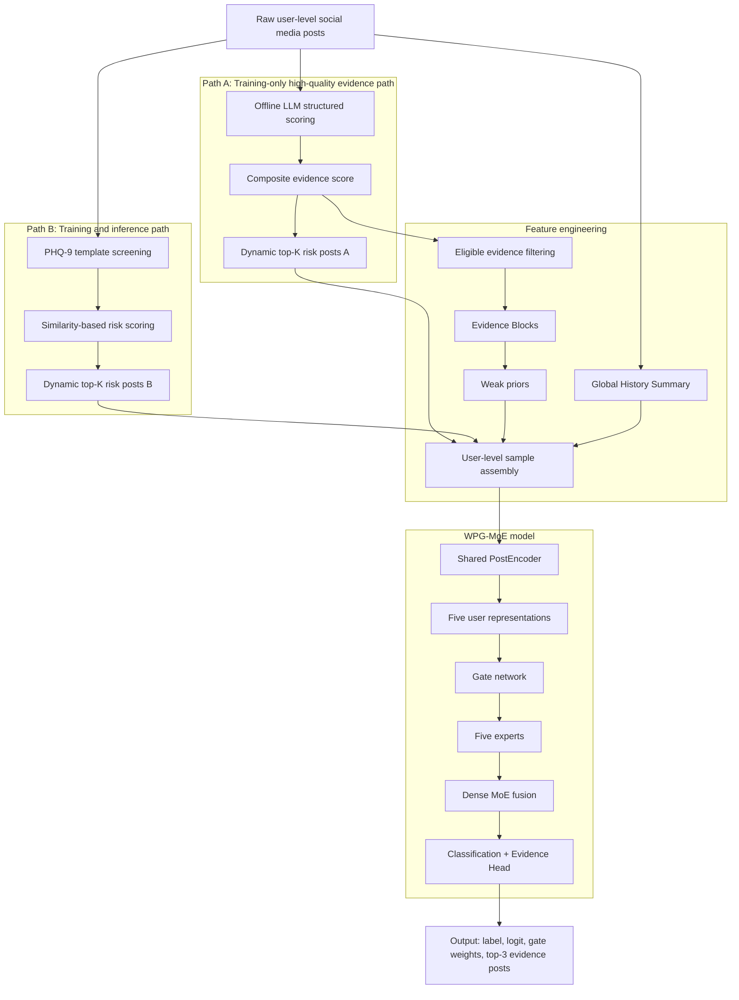

# WPG-MoE Pipeline Summary for Figure Generation

## Suggested Figure Caption

Overall pipeline of the WPG-MoE social media depression detection system, showing dual-path risk-post construction, user-level feature building, weak-prior-guided dense mixture-of-experts modeling, and inference-time evidence-based prediction.

## System Goal

WPG-MoE is a user-level depression detection framework for social media data. Its goal is not only to classify whether a user is depressed, but also to identify which posts serve as the strongest supporting evidence. The system combines two complementary risk-post construction paths, a feature engineering stage that builds temporal and user-level signals, and a Dense MoE model that routes each user through multiple expert channels.

The system follows a LUPI-style design: training uses privileged signals such as offline LLM-based structured scoring, weak priors, and episode blocks, while inference uses only deployable inputs such as template-selected risk posts, global history, and trained model weights.

## High-Level Pipeline

## Core Components

### 1. Dual-path risk-post construction

- **Path A** is available only during training.
- It starts from offline LLM-based structured scoring of depressed users' posts.
- A rule-based `composite_evidence_score` is computed from symptom strength, crisis level, anchors, duration support, confidence, and self-disclosure cues.
- The top posts are selected with a dynamic top-K rule to form **risk posts A**.

- **Path B** is used in both training and inference.
- Each post is compared against PHQ-9 symptom templates using sentence embeddings and cosine similarity.
- A template-based `risk_score` is computed and the top posts are selected with the same dynamic K rule to form **risk posts B**.

### 2. Feature engineering

- Eligible evidence posts are filtered from fully scored posts.
- Temporally close evidence posts are merged into **Evidence Blocks**, which represent sustained depressive episodes rather than isolated posts.
- Three weak priors are computed:
  - `p_sd`: self-disclosure prior
  - `p_ep`: episode-supported prior
  - `p_sp`: sparse-evidence prior
- A **Global History Summary** is built from the full posting history by dividing all posts into 8 temporal segments and sampling representative posts.
- These elements are assembled into user-level training samples.

### 3. WPG-MoE model

- A shared **PostEncoder** encodes risk posts, block posts, and global-history posts.
- The model builds five user-level representations:
  - `z_sd`: self-disclosure stream
  - `z_ep`: episode-supported stream
  - `z_sp`: sparse-evidence stream
  - `z_mix`: mixed stream
  - `z_g`: global-history stream
- A **Gate Network** predicts 5 expert weights.
- Five experts process the user through different semantic channels.
- A **Dense MoE** module fuses all expert outputs.
- A classification head predicts depression risk.
- An **Evidence Head** scores each risk post and returns the top-3 supporting posts.

## Training vs Inference

### Training

- Uses both **risk posts A** and **risk posts B**.
- Can access weak priors, crisis score, and Evidence Blocks.
- Includes three major stages:
  - encoder pretraining
  - expert warm start
  - joint training
- Uses multi-layer dropout to reduce the mismatch between training and inference.

### Inference

- Uses only **risk posts B** and **global history**.
- Does **not** use LLM-based structured scoring.
- Does **not** use weak priors, crisis priors, or Evidence Blocks as input.
- Still produces interpretable outputs: label, probability, dominant expert channel, and top-3 evidence posts.

## Key Design Ideas to Emphasize in the Figure

- The system should look like a **left-to-right or top-to-bottom pipeline** with clear stages.
- The figure should clearly separate:
  - **training-only Path A**
  - **shared Path B**
  - **feature engineering**
  - **model architecture**
  - **final outputs**
- The relationship between training and inference should be explicit:
  - training uses richer privileged signals
  - inference uses a simplified, deployable input path
- The Dense MoE module should be visually prominent because it is the core modeling contribution.
- The Evidence Head and top-3 evidence posts should appear as a distinct output branch, not as a small detail.

## Recommended Visual Emphasis

- Show Path A and Path B as two clearly separated branches that merge before user-level sample construction.
- Depict Evidence Blocks and weak priors as intermediate structured signals derived from training-time evidence.
- Show the five user representations feeding into a gate network and five experts.
- Show Dense MoE fusion as the central integration point before final prediction.
- Show a second output branch for evidence selection and interpretation.

## Short Summary

WPG-MoE is a dual-path, user-level depression detection framework for social media. During training, it combines offline LLM-based evidence scoring, template-based risk-post screening, temporal evidence aggregation, weak priors, and global history. These signals are fed into a weak-prior-guided Dense MoE model with five expert channels. During inference, the system removes privileged signals and relies only on template-selected risk posts, global history, and trained weights, while still producing both classification results and top-3 evidence posts.
