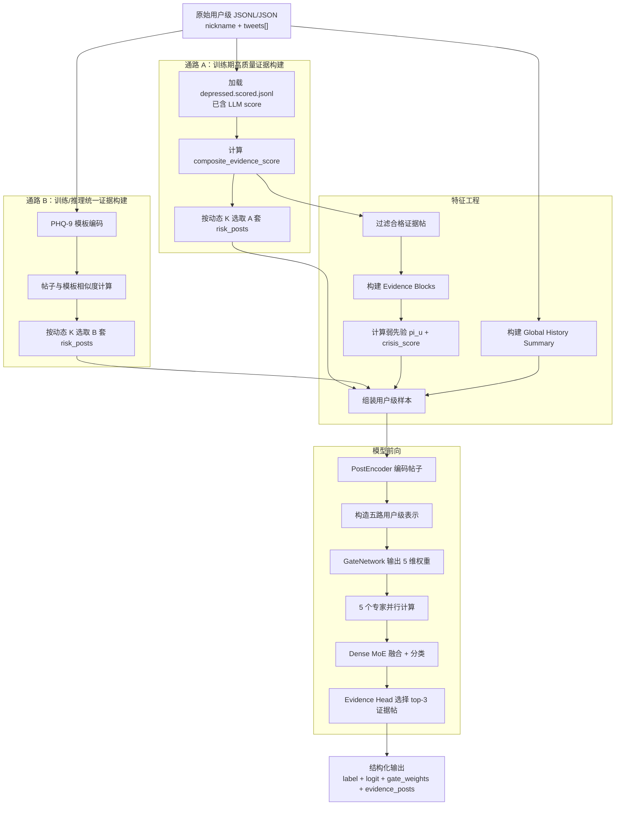

# WPG-MoE 社交媒体抑郁检测系统整体架构说明

## 1. 系统概览

WPG-MoE（Weak-Prior-Guided Dense Mixture-of-Experts）是一个面向社交媒体抑郁检测的用户级建模系统。它不是直接对全部帖子做简单文本分类，而是围绕“证据筛选、时间支持、弱先验引导、专家融合、证据解释”构建了一条分阶段的数据与模型流水线。

该系统的核心范式是 **LUPI（Learning Using Privileged Information）**：训练阶段允许使用仅训练可见的 LLM 特权信息，例如全量结构化打分、弱先验和 episode blocks；推理阶段则退化为只依赖模板筛选得到的风险帖子、全局历史和训练好的模型权重，从而兼顾训练信号丰富性与部署可行性。

从整体设计上看，系统由五个层次组成：

- 数据管线：将原始用户级 JSONL 标准化，并分别构建 A/B 两套 risk posts。
- 特征工程：从全量打分结果中构建 Evidence Block、弱先验和用户级样本。
- 模型定义：使用共享帖子编码器、五路用户表示、Dense MoE 和 Evidence Head 完成用户级预测。
- 训练流程：先做帖子级预训练，再做专家 warm-start，最后联合训练。
- 推理部署：只保留推理可获得的输入，输出标签、专家权重和 top-3 证据帖子。

本文档以 `00_Main_Orchestrator.md` 定义的主架构为唯一叙事主线，并用 `01-05` 五个执行文件补充模块职责、输入输出、关键步骤和代码落点。

信息来源：`00_Main_Orchestrator.md`，辅以 `01_Data_Pipeline.md`、`02_Feature_Engineering.md`、`03_Model_Definition.md`、`04_Training.md`、`05_Inference.md`

## 2. 端到端主流程总览

### 2.1 主流程图

### 2.2 真实执行顺序

1. 系统接收用户级原始数据，每行一个用户对象，包含 `nickname`、`label`、`gender` 和 `tweets[]`。
2. 数据管线先做统一标准化，将 `nickname -> user_id`、`tweet_content -> text`，并合成 `post_id`。
3. 对训练期 depressed 用户，通路 A 读取已离线完成 LLM 打分的 `depressed.scored.jsonl`，基于规则计算 `composite_evidence_score`，再按动态 K 选出 A 套 risk posts。
4. 对所有用户，通路 B 使用 PHQ-9 模板与帖子 embedding 相似度构建 B 套 risk posts；这一路既服务训练，也服务推理。
5. 特征工程阶段从全量打分帖子中过滤合格证据帖，按时间邻近性构建 Evidence Blocks，并计算三通道弱先验 `pi_u=(p_sd,p_ep,p_sp)` 与 `crisis_score`。
6. 同时，系统会对全部帖子构建 Global History Summary，将完整历史切成 8 段并做覆盖式采样，以保留用户长程行为上下文。
7. 在样本构建阶段，训练集 depressed 用户保留 A/B 双套 risk posts、弱先验、episode blocks 和 global history；normal 用户以及验证/测试中的 depressed 用户统一退化为“推理兼容格式”。
8. 模型前向时，PostEncoder 对 risk posts、episode blocks 和 global history 中的帖子编码，随后构造五路用户级表示：
   - `z_sd`：自述披露流
   - `z_ep`：时间支持流
   - `z_sp`：稀疏证据流
   - `z_mix`：混合流
   - `z_g`：全局历史流
9. GateNetwork 结合五路表示、弱先验、危机分数和全局统计特征，输出 5 维专家权重。
10. 五个专家并行生成各自的判别表示，由 Dense MoE 做加权融合并完成用户级分类。
11. Evidence Head 根据帖子表示、融合后的用户表示和 gate 权重，对每条 risk post 计算证据分数，最终输出 top-3 关键证据帖。
12. 推理阶段可选地基于模型输出再生成自然语言解释，但该步骤不影响分类结果。

### 2.3 数据流与模块衔接关系

- 数据流从“用户级原始 JSONL”开始，但训练与推理在中段出现分叉：训练可见通路 A 的高质量 LLM 打分结果，推理只能使用通路 B。
- Evidence Blocks 和弱先验并不直接服务最终部署输入，它们主要用于训练期塑造更好的路由与专家分工。
- Global History 是训练与推理之间保持一致的核心桥梁之一，因为它不依赖任何特权标签或 LLM。
- 最终的用户级预测不只输出二分类结果，还输出 gate 权重和证据帖子索引，从而让模型具备一定的可解释性。

信息来源：以 `00_Main_Orchestrator.md` 的“系统架构总览”“训练阶段流转图”为主，补充 `01_Data_Pipeline.md`、`02_Feature_Engineering.md`、`05_Inference.md`

## 3. 模块分解说明

### 3.1 数据管线

**模块目标**

将原始用户级数据标准化，并构建两套风险帖子表示：A 套基于离线 LLM 打分后的规则评分，B 套基于 PHQ-9 模板筛选。

**输入**

- `depressed.scored.jsonl`：depressed 用户原始 JSONL，已含 LLM `score` 嵌套字段。
- `control.cleaned.jsonl` 或 `normal.cleaned.jsonl`：control/normal 用户原始 JSONL，不含 `score`。

**输出**

- `all_users_standardized.jsonl`
- `depressed_scored_posts.jsonl`
- `risk_posts_a.json`
- `risk_posts_b.json`
- `splits.json`

**核心步骤**

1. 字段标准化：统一 `label` 类型、`gender` 缺失值、`tweet_is_original` 布尔值，并合成 `post_id`。
2. 数据划分：
   - SWDD / Twitter：按用户级标签做 80/10/10 分层采样。
   - eRisk：采用 5-fold CV。
3. 通路 A：
   - 对 depressed 用户的全量打分帖子计算 `composite_evidence_score`。
   - 按动态 K 选取 A 套 risk posts。
4. 通路 B：
   - 用 `gte-small-zh`、`bge-small-zh` 或 `MiniLM` 编码帖子与 PHQ-9 模板。
   - 以余弦相似度构建每帖的 `risk_score` 与 `matched_dimensions`。
   - 按动态 K 选出 B 套 risk posts。

**动态 K 策略**

| 用户总帖子数 N | 选取规则 |
|---|---|
| `N >= 160` | `ceil(N * 0.125)` |
| `20 <= N < 160` | `20` |
| `N < 20` | `N` |

**与其他模块的依赖关系**

- 为 `02_Feature_Engineering` 提供所有正式输入产物。
- 为 `05_Inference` 复用 PHQ-9 模板筛选逻辑。
- 通路 A 的 LLM 打分步骤不再在线执行，仅复用离线结果。

信息来源：`01_Data_Pipeline.md`，并与 `00_Main_Orchestrator.md` 的通路 A / 通路 B 定义对齐

### 3.2 特征工程

**模块目标**

从帖子级结果中提炼用户级训练信号，包括 Evidence Block、弱先验、Global History Summary 和最终用户级样本。

**输入**

- 标准化后的全部用户帖子
- depressed 用户的全量打分帖子
- A 套 risk posts
- B 套 risk posts
- 数据划分结果

**输出**

- `data/user_samples/{dataset}_train.jsonl`
- `data/user_samples/{dataset}_val.jsonl`
- `data/user_samples/{dataset}_test.jsonl`

**核心步骤**

1. 合格证据帖过滤：
   - `first_person == True`
   - `literal_self_evidence == True`
   - `composite_evidence_score >= 0.3`
2. Evidence Block 构建：
   - 按时间排序，将相邻间隔不超过 `max_gap_days=7~10` 的帖子并为同一 block。
   - 为 block 计算跨度、症状覆盖度、重复天数、功能损伤、危机等级等统计特征。
3. 弱先验计算：
   - `p_sd`：强调当前自述、临床锚点与时态证据。
   - `p_ep`：强调连续时间跨度与持续性症状块。
   - `p_sp`：面向少量但高强度证据的用户，仅在 `p_sd` / `p_ep` 不显著时触发。
   - `crisis_score`：取全量帖子中的最大危机等级。
4. Global History Summary：
   - 将全部帖子按时间切分为 `S=8` 段。
   - 每段按覆盖率 `60%` 动态采样，`K_seg = ceil(0.6*N/8)`，上限 `128`。
5. 用户级样本组装：
   - 训练集 depressed 用户：保留 A/B 双套 risk posts、非零弱先验、top-m blocks 和 global history。
   - normal 用户与验证/测试 depressed 用户：退化为 template-only 格式，只保留 B 套 risk posts、零先验、空 blocks。

**与其他模块的依赖关系**

- 消费 `01_Data_Pipeline` 的所有 processed 产物。
- 为 `04_Training` 输出统一的用户级样本合同。
- 其“推理兼容格式”直接服务训练到推理的桥接设计。

信息来源：`02_Feature_Engineering.md`，并由 `00_Main_Orchestrator.md` 的 FEATURE/SAMPLE 子图约束主线

### 3.3 模型定义

**模块目标**

定义从帖子编码到用户级预测的整套神经网络，包括共享编码器、五路表示、门控网络、专家组、MoE 融合头和证据选择头。

**输入**

- `risk_post_texts` 与 `risk_post_markers`
- `episode_block_texts`
- `global_history_texts`
- `pi_u`
- `crisis_score`
- `global_stats`
- `has_meta`

**输出**

- `logit`
- `gate_weights`
- `evidence_scores`
- `expert_outputs`

**核心步骤**

1. **PostEncoder**
   - 使用 Qwen3.5-2B + LoRA。
   - 在 tokenizer 中手动加入 `[POST_01]...[POST_XX]` 与 `[META]`。
   - 取 `[POST_xx]` token 的最后层隐状态作为帖子表示。
2. **五路用户级表示**
   - `z_sd`：对 risk posts 做 attention pooling。
   - `z_ep`：优先基于 episode blocks；若为空则 fallback 到 risk posts。
   - `z_sp`：只关注 top-3 risk posts。
   - `z_mix`：对 risk posts 做 mean pooling。
   - `z_g`：基于 global history 段表示做时序自注意力，再与统计特征投影相加。
3. **GateNetwork**
   - 输入五路表示、弱先验、危机分数和统计特征。
   - 使用两层 MLP 输出 5 维 softmax 权重。
4. **ExpertGroup**
   - 五个专家结构相同，语义上分别对应 SD / EP / SP / MIX / G 五类输入侧重点。
5. **MoEHead**
   - 对 5 个专家输出做 Dense 加权融合，不做稀疏裁剪。
   - 之后接分类头输出用户级 logit。
6. **EvidenceHead**
   - 对每条 risk post 计算 `s_i = sigmoid(MLP([h_i; h_u; g]))`。
   - 选取 top-3 证据帖子。

**与其他模块的依赖关系**

- 被 `04_Training` 直接调用用于预训练、warm-start 和联合训练。
- 被 `05_Inference` 直接加载并执行前向推理。

信息来源：`03_Model_Definition.md`，并与 `00_Main_Orchestrator.md` 的 ENCODER / USER_REP / MOE / OUTPUT 子图对齐

### 3.4 训练流程

**模块目标**

通过多阶段训练，让编码器先学到帖子级抑郁证据强度，再让专家形成初始分工，最终完成端到端联合优化。

**输入**

- 用户级训练样本与验证样本
- depressed 用户全量打分帖子

**输出**

- 预训练编码器权重
- warm-start 专家权重
- 最终模型权重
- 训练日志

**核心步骤**

1. **阶段 C：帖子编码器预训练**
   - 任务：给定帖子文本，预测 `composite_evidence_score`。
   - 数据：depressed 用户全量打分帖子。
   - 特点：使用 `MSE` 做回归，并执行 `META Dropout`。
2. **阶段 D：专家 Warm-Start**
   - 对 depressed 训练用户按先验排序，分别抽取 top-30% 子集对 `Expert_SD / EP / SP` 做短训练。
   - `Expert_MIX` 使用全部 depressed 用户。
   - `Expert_G` 使用全部用户。
3. **阶段 E：联合训练**
   - 使用多层 Dropout 数据增强。
   - 差异化学习率：LoRA 参数较小，头部参数较大。
   - 使用综合损失联合优化分类、路由、证据、负载均衡与熵正则。

**总损失函数**

`L = L_cls + α·L_route + β·L_evidence + γ·L_balance + δ·L_entropy`

| 损失项 | 作用 |
|---|---|
| `L_cls` | 用户级抑郁分类 |
| `L_route` | 仅在高置信用户上，用弱先验约束 gate 前 3 维 |
| `L_evidence` | 用 silver label 监督 Evidence Head |
| `L_balance` | 避免专家负载失衡 |
| `L_entropy` | 防止 Dense MoE 退化为 one-hot 路由 |

**多层 Dropout 机制**

- Risk Source Swap：训练期在 A/B 套 risk posts 间切换。
- META Dropout：去掉结构化标签，逼近推理场景。
- Episode Block Dropout：强制模型在无 blocks 情况下仍可工作。
- Prior Dropout：让 gate 学会在零先验下路由。
- Post Drop：随机删除部分 risk posts，增强鲁棒性。

**与其他模块的依赖关系**

- 消费 `02_Feature_Engineering` 输出的用户级样本。
- 复用 `03_Model_Definition` 中的统一模型结构。
- 为 `05_Inference` 产出最终部署权重。

信息来源：`04_Training.md`，并由 `00_Main_Orchestrator.md` 的训练阶段流转图约束阶段顺序

### 3.5 推理部署

**模块目标**

在不依赖 LLM 打分的前提下，对新用户执行端到端推理，并输出标签、概率、专家路由和关键证据帖。

**输入**

- 原始用户级 JSONL
- 模型权重
- 模板筛选编码器

**输出**

- `user_id`
- `label`
- `depressed_logit`
- `crisis_score`
- `gate_weights`
- `dominant_channel`
- `evidence_post_ids`
- `evidence_scores`
- `explanation`（可选）

**核心步骤**

1. 将原始用户级记录标准化为内部帖子列表。
2. 对全部帖子做 PHQ-9 模板筛选，得到 B 套 risk posts。
3. 对全部帖子构建 global history 段表示与全局统计特征。
4. 构造模型输入时，强制使用推理兼容配置：
   - `risk_posts_llm` 不存在
   - `[META]` 不附加
   - `episode_blocks = []`
   - `pi_u = 0`
   - `crisis_score = 0`
5. 运行模型前向，输出分类结果、专家权重和 top-3 证据帖子。
6. 如需要，再基于证据帖子生成自然语言解释。

**与其他模块的依赖关系**

- 复用 `01_Data_Pipeline` 的模板筛选逻辑。
- 直接加载 `04_Training` 产出的最终模型权重。
- 不依赖 `02_Feature_Engineering` 中的特权信息输入。

信息来源：`05_Inference.md`，并与 `00_Main_Orchestrator.md` 的推理端定义保持一致

## 4. 关键数据结构与中间产物

| 数据结构 / 产物 | 核心字段 | 作用 |
|---|---|---|
| 原始用户记录 | `nickname`, `label`, `gender`, `tweets[]` | 系统最初输入合同，保持用户级组织方式 |
| 标准化用户数据 | `user_id`, `label`, `gender`, `posts[]` | 统一字段命名与类型，作为后续处理基座 |
| 帖子级打分数据 | `post_id`, `text`, `symptom_vector`, `confidence`, `temporality`, `composite_evidence_score` | 承载通路 A 的全量结构化信息，为 block 和先验提供基础 |
| A 套 risk posts | `post_id`, `text`, `composite_evidence_score`, `crisis_level`, `temporality` | 训练期高质量风险帖子输入，带有强语义与弱标签 |
| B 套 risk posts | `post_id`, `text`, `risk_score`, `matched_dimensions`, `dim_scores` | 训练/推理通用风险帖子输入，是部署时唯一可获得的筛选结果 |
| Evidence Block | `block_id`, `post_ids`, `block_span_days`, `symptom_category_count`, `block_score` | 将离散证据聚合成时间连续的发作片段，用于 `z_ep` 与 `p_ep` |
| 用户级训练样本 | `priors`, `risk_posts_llm`, `risk_posts_template`, `episode_blocks`, `global_history_posts`, `global_stats` | 将帖子级信息提升为统一的用户级训练合同 |
| 模型输出 | `depressed_logit`, `gate_weights`, `dominant_channel`, `evidence_post_ids`, `evidence_scores` | 同时支持分类、专家分析和证据解释 |

### 4.1 弱先验的语义角色

| 先验 | 含义 | 主要依据 |
|---|---|---|
| `p_sd` | 自述披露倾向 | 当前自述、临床锚点、当前时态、自述置信度 |
| `p_ep` | 时间支持倾向 | 最优 Evidence Block 的跨度、症状多样性、持续性和功能损伤 |
| `p_sp` | 稀疏证据倾向 | 少量但高强度帖子上的 composite 分数与置信度 |
| `crisis_score` | 危机等级 | 用户全部帖子中的最大 `crisis_level` |

### 4.2 用户级训练样本的两种合同

| 样本类型 | 适用对象 | 特征 |
|---|---|---|
| 完整训练样本 | 训练集 depressed 用户 | 保留 A/B 双套 risk posts、非零先验、episode blocks 和 global history |
| 推理兼容样本 | normal 用户、验证/测试 depressed 用户、真实推理用户 | 只保留 B 套 risk posts 与 global history，先验全零，blocks 为空 |

信息来源：`00_Main_Orchestrator.md` 的全局数据结构定义，辅以 `01_Data_Pipeline.md` 和 `02_Feature_Engineering.md`

## 5. 训练流程与推理流程的关系

### 5.1 训练与推理的输入对照

| 输入组件 | 训练集 depressed 用户 | normal / val-test depressed 用户 | 真实推理 | 桥接机制 |
|---|---|---|---|---|
| risk posts | A/B 双套切换 | 始终 B 套 | 始终 B 套 | Risk Source Swap |
| META 标签 | 可用 | 不用 | 不用 | META Dropout |
| episode blocks | 可用 | 为空 | 为空 | Block Dropout |
| 弱先验 `pi_u` | 可用 | 全零 | 全零 | Prior Dropout |
| `crisis_score` | 可用 | 0 | 0 | Prior Dropout / 输出合同对齐 |
| global history | 始终可用 | 始终可用 | 始终可用 | 训练推理完全一致 |

### 5.2 LUPI 的具体落点

本系统的 LUPI 不是把特权信息直接搬进推理流程，而是只在训练时提供更强的辅助信号：

- 通路 A 的全量 LLM 打分只在训练数据构造中使用。
- Evidence Block 只在训练期显式存在，推理时为空。
- 弱先验只在训练期提供路由提示，推理阶段全部置零。
- 通过 Risk Source Swap、META Dropout、Block Dropout 和 Prior Dropout，系统被强制学习在“没有特权信息”的输入条件下依然稳定工作。

### 5.3 训练与推理的一致性设计意义

- 模型不会过度依赖 LLM 打分或先验标签，因为这些信号在训练中被周期性移除。
- 推理时保留下来的 B 套 risk posts 与 global history 成为稳定、低成本、可部署的最小输入闭环。
- 这种设计既保留了训练期的高信息密度，也避免了线上系统必须承担昂贵且不稳定的 LLM 全量打分开销。

信息来源：`00_Main_Orchestrator.md`，`02_Feature_Engineering.md`，`04_Training.md`，`05_Inference.md`

## 6. 系统设计亮点与关键机制

### 6.1 双通路 risk post 构建

系统没有把“风险帖子选择”当作单一路径问题，而是显式维护两套输入视角：

- 通路 A 强调高质量、强监督、训练期特权信息。
- 通路 B 强调低成本、训练推理一致和部署可行性。

这种双通路设计为后续 Risk Source Swap 提供了基础，使模型能在高质量与可部署输入之间建立鲁棒映射。

### 6.2 Evidence Block

Evidence Block 解决的是“单条帖子不足以表达持续抑郁状态”的问题。它把时间上相近的合格证据帖聚合为一个 episode，显式建模持续性、症状覆盖度和功能损伤，从而让 `z_ep` 与 `p_ep` 能表达“时间支持的抑郁信号”。

### 6.3 弱先验引导路由

`p_sd / p_ep / p_sp` 不是 hard label，也不是 one-hot 路由标签，而是连续弱语义先验。它们只在高置信用户上启用 `L_route`，用来轻柔地引导 gate 前 3 维，不强迫模型对所有样本做人工分派。

### 6.4 Dense MoE 而不是 Sparse MoE

该系统采用的是 Dense MoE：所有专家始终参与，只是权重不同。这能减少 one-hot 路由的脆弱性，更适合心理健康场景中常见的混合型和边界型表达模式。

### 6.5 Evidence Head 的可解释输出

模型不仅输出 `label`，还输出：

- `gate_weights`：说明用户主要匹配哪类表达通道；
- `dominant_channel`：给出当前主导模式；
- `evidence_post_ids` 与 `evidence_scores`：指出促成预测的关键帖子。

这使系统具备从“判别”走向“证据化解释”的能力。

### 6.6 多阶段训练与多层 Dropout

系统不是一次性端到端训练，而是采用“编码器预训练 -> 专家 warm-start -> 联合训练”的递进式优化，同时把训练到推理的分布落差吸收进 Dataset 层面的多层 Dropout 中。这是整个系统能够稳定上线的关键工程设计。

信息来源：`00_Main_Orchestrator.md`，`02_Feature_Engineering.md`，`03_Model_Definition.md`，`04_Training.md`

## 7. 模块依赖与文件对应关系

| 架构模块 | 对应规划文件 | 建议代码文件 / 脚本位置 | 在整体系统中的位置 |
|---|---|---|---|
| 总体编排与数据契约 | `00_Main_Orchestrator.md` | 作为架构总控文档使用 | 定义全局主线、数据结构、训练阶段与依赖关系 |
| 数据管线 | `01_Data_Pipeline.md` | `src/data/raw_loader.py` `src/data/composite_scorer.py` `src/data/template_screener.py` `scripts/run_template_screening.py` | 负责原始数据标准化、A/B 风险帖子构建、数据划分 |
| 特征工程 | `02_Feature_Engineering.md` | `src/features/evidence_block.py` `src/features/weak_priors.py` `src/features/global_history.py` `src/features/user_sample_builder.py` `scripts/build_user_samples.py` | 负责把帖子级信息提升为用户级训练样本 |
| 模型定义 | `03_Model_Definition.md` | `src/model/post_encoder.py` `src/model/user_representation.py` `src/model/gate_network.py` `src/model/expert_network.py` `src/model/moe_head.py` `src/model/evidence_head.py` `src/model/full_model.py` | 定义从帖子编码到用户级预测的全部网络组件 |
| 训练流程 | `04_Training.md` | `src/training/dataset.py` `src/training/losses.py` `src/training/encoder_pretrain.py` `src/training/warm_start.py` `src/training/joint_trainer.py` `scripts/train.py` | 负责多阶段训练、损失函数和参数优化 |
| 推理部署 | `05_Inference.md` | `src/inference/pipeline.py` `src/inference/explanation.py` `scripts/infer.py` | 负责线上或离线批量推理与解释生成 |

### 7.1 模块依赖顺序

1. `01_Data_Pipeline` 与 `03_Model_Definition` 可并行准备。
2. `02_Feature_Engineering` 依赖 `01` 的正式产物。
3. `04_Training` 依赖 `02` 的用户级样本和 `03` 的模型实现。
4. `05_Inference` 依赖 `04` 的最终模型权重，同时复用 `01` 的模板筛选逻辑。

### 7.2 当前规划中的待统一项

以下内容在现有规划中存在轻微实现差异，后续正式编码时建议统一：

- **帖子最大长度**：`00_Main_Orchestrator.md` 的超参数表将帖子最大长度写为 `512 tokens`，而 `03_Model_Definition.md` 中 `PostEncoder` 示例默认值为 `256`。主架构文档应以 `00` 的系统级参数为准，具体实现需在配置层统一。
- **`avg_sentiment_trend`**：`03_Model_Definition.md` 与 `04_Training.md` 中的 `global_stats` 含一个 `avg_sentiment_trend` 占位维度，但 `02_Feature_Engineering.md` 当前只明确给出了 `total_posts / eligible_evidence_posts / posting_freq / active_span_days / temporal_burstiness`。该维度的真实来源与计算方式仍需确认。

信息来源：`00_Main_Orchestrator.md`，`01_Data_Pipeline.md`，`02_Feature_Engineering.md`，`03_Model_Definition.md`，`04_Training.md`，`05_Inference.md`

## 8. 总结

WPG-MoE 的整体流程可以概括为：系统先把原始用户级社交媒体数据标准化，再通过离线 LLM 规则评分与在线模板筛选构建两套风险帖子视图；随后在特征工程阶段提炼 Evidence Blocks、弱先验和全局历史，将帖子级信息提升为用户级样本；模型侧则用共享帖子编码器生成多路用户表示，经 GateNetwork 引导五个专家做 Dense 融合，并通过 Evidence Head 输出 top-3 关键证据帖；训练阶段利用特权信息增强学习，但通过多层 Dropout 保证推理阶段仅依赖 B 套 risk posts、全局历史和训练好的模型权重即可完成稳定预测与解释输出。这使得该系统同时具备较强的训练信号、明确的结构归因能力和可部署的推理闭环。

信息来源：综合 `00_Main_Orchestrator.md` 至 `05_Inference.md`
