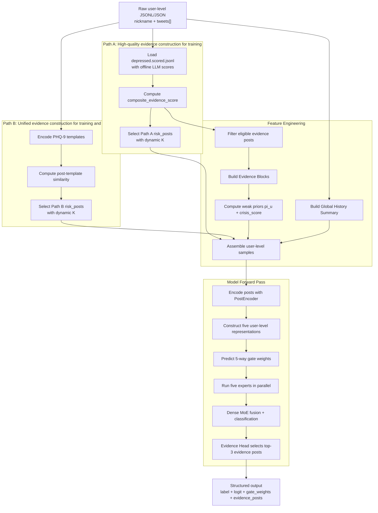

# WPG-MoE Social Media Depression Detection System Architecture

## 1. System Overview

WPG-MoE (Weak-Prior-Guided Dense Mixture-of-Experts) is a user-level modeling system for depression detection from social media data. Instead of treating the task as a flat text classification problem over all posts, it builds a staged pipeline centered on evidence screening, temporal support, weak-prior-guided routing, expert fusion, and evidence-based interpretation.

The core learning paradigm is **LUPI (Learning Using Privileged Information)**. During training, the model is allowed to access privileged signals that are not available at inference time, such as full LLM-based structured scoring, weak priors, and episode blocks. During inference, the system is reduced to inputs that are realistically deployable: template-selected risk posts, global history, and trained model weights. This design balances rich supervision during training with practicality at deployment.

At a high level, the system is organized into five layers:

- Data pipeline: standardizes raw user-level JSONL files and constructs two sets of risk posts.
- Feature engineering: derives Evidence Blocks, weak priors, and user-level samples from scored posts.
- Model definition: performs user-level prediction with a shared post encoder, five user representations, a Dense MoE module, and an Evidence Head.
- Training pipeline: pretrains the encoder, warm-starts experts, and then runs joint training.
- Inference deployment: keeps only deployable inputs and outputs labels, expert weights, and top-3 evidence posts.

This document uses the architecture defined in `00_Main_Orchestrator.md` as the single narrative backbone, while `01-05` are used only to supplement module responsibilities, inputs and outputs, key processing steps, and suggested code locations.

Sources: `00_Main_Orchestrator.md`, supplemented by `01_Data_Pipeline.md`, `02_Feature_Engineering.md`, `03_Model_Definition.md`, `04_Training.md`, and `05_Inference.md`

## 2. End-to-End Workflow Overview

### 2.1 Main Flow Diagram

### 2.2 Actual Execution Order

1. The system receives raw user-level data, one user object per line, containing `nickname`, `label`, `gender`, and `tweets[]`.
2. The data pipeline first standardizes the schema by mapping `nickname -> user_id`, `tweet_content -> text`, and generating `post_id`.
3. For depressed users in training, Path A reads `depressed.scored.jsonl`, whose LLM scoring has already been completed offline, computes `composite_evidence_score` with fixed rules, and then selects Path A risk posts using dynamic K.
4. For all users, Path B builds risk posts through similarity between post embeddings and PHQ-9 templates. This path is used in both training and inference.
5. In feature engineering, the system filters eligible evidence posts from the fully scored posts, groups them into Evidence Blocks based on temporal proximity, and computes three weak priors `pi_u=(p_sd,p_ep,p_sp)` together with `crisis_score`.
6. In parallel, the system builds a Global History Summary over all posts by splitting the full timeline into 8 segments and sampling posts with target coverage.
7. At the sample construction stage, depressed users in the training set retain both Path A and Path B risk posts, weak priors, episode blocks, and global history. Normal users and depressed users in validation and test splits are converted into an inference-compatible format.
8. During the model forward pass, the PostEncoder encodes posts from risk posts, episode blocks, and global history, after which the model constructs five user-level representations:
   - `z_sd`: self-disclosure stream
   - `z_ep`: episode-supported stream
   - `z_sp`: sparse-evidence stream
   - `z_mix`: mixed stream
   - `z_g`: global-history stream
9. The GateNetwork combines these five representations with weak priors, crisis score, and global statistics to produce 5 expert weights.
10. The five experts generate their own discriminative outputs in parallel, which are fused by a Dense MoE layer for user-level classification.
11. The Evidence Head scores each risk post using the post representation, fused user representation, and gate weights, and finally returns the top-3 evidence posts.
12. At inference time, a natural-language explanation may optionally be generated from the model outputs, but this does not affect classification itself.

### 2.3 Data Flow and Module Connectivity

- The data flow starts from raw user-level JSONL, but training and inference diverge in the middle of the pipeline: training can access the high-quality LLM-derived outputs of Path A, whereas inference is restricted to Path B.
- Evidence Blocks and weak priors are not direct deployment inputs. Their primary role is to shape better routing and expert specialization during training.
- Global History is one of the key bridges between training and inference because it does not depend on any privileged labels or LLM calls.
- The final user-level prediction includes not only the binary classification result but also gate weights and evidence post indices, giving the model a degree of interpretability.

Sources: primarily the "System Architecture Overview" and "Training Stage Flow" in `00_Main_Orchestrator.md`, with additional detail from `01_Data_Pipeline.md`, `02_Feature_Engineering.md`, and `05_Inference.md`

## 3. Module Breakdown

### 3.1 Data Pipeline

**Objective**

Standardize raw user-level data and construct two complementary sets of risk posts: Path A based on offline LLM-derived structured scoring plus rule-based aggregation, and Path B based on PHQ-9 template screening.

**Inputs**

- `depressed.scored.jsonl`: raw JSONL for depressed users, already containing nested LLM `score` fields.
- `control.cleaned.jsonl` or `normal.cleaned.jsonl`: raw JSONL for control or normal users, without `score`.

**Outputs**

- `all_users_standardized.jsonl`
- `depressed_scored_posts.jsonl`
- `risk_posts_a.json`
- `risk_posts_b.json`
- `splits.json`

**Core Steps**

1. Field normalization:
   - unify `label` types
   - normalize missing `gender`
   - normalize `tweet_is_original`
   - generate `post_id`
2. Data splitting:
   - SWDD / Twitter: user-level stratified 80/10/10 split
   - eRisk: 5-fold cross-validation
3. Path A:
   - compute `composite_evidence_score` for fully scored posts from depressed users
   - select Path A risk posts with dynamic K
4. Path B:
   - encode posts and PHQ-9 templates with `gte-small-zh`, `bge-small-zh`, or `MiniLM`
   - compute per-post `risk_score` and `matched_dimensions` from cosine similarity
   - select Path B risk posts with dynamic K

**Dynamic K Strategy**

| Total number of posts N | Selection rule |
|---|---|
| `N >= 160` | `ceil(N * 0.125)` |
| `20 <= N < 160` | `20` |
| `N < 20` | `N` |

**Dependencies**

- Produces all formal inputs for `02_Feature_Engineering`.
- Provides the PHQ-9 template screening logic reused by `05_Inference`.
- The LLM scoring part of Path A is no longer executed online and is only consumed from offline outputs.

Sources: `01_Data_Pipeline.md`, aligned with the Path A / Path B definitions in `00_Main_Orchestrator.md`

### 3.2 Feature Engineering

**Objective**

Convert post-level results into user-level training signals, including Evidence Blocks, weak priors, Global History Summary, and final user-level samples.

**Inputs**

- standardized posts for all users
- fully scored posts for depressed users
- Path A risk posts
- Path B risk posts
- split definitions

**Outputs**

- `data/user_samples/{dataset}_train.jsonl`
- `data/user_samples/{dataset}_val.jsonl`
- `data/user_samples/{dataset}_test.jsonl`

**Core Steps**

1. Eligible evidence filtering:
   - `first_person == True`
   - `literal_self_evidence == True`
   - `composite_evidence_score >= 0.3`
2. Evidence Block construction:
   - sort by time and merge neighboring posts if the temporal gap is at most `max_gap_days=7~10`
   - compute block-level features such as span, symptom coverage, repeated days, functional impairment, and crisis level
3. Weak prior computation:
   - `p_sd`: emphasizes current self-disclosure, clinical anchors, and temporality
   - `p_ep`: emphasizes temporal continuity and sustained symptom blocks
   - `p_sp`: targets users with only a few but strong evidence posts, and is only activated when `p_sd` and `p_ep` are not dominant
   - `crisis_score`: the maximum crisis level across all scored posts
4. Global History Summary:
   - split all posts into `S=8` temporal segments
   - sample each segment with target coverage `60%`, using `K_seg = ceil(0.6*N/8)` capped at `128`
5. User-level sample assembly:
   - depressed users in training retain both Path A and Path B risk posts, nonzero priors, top-m blocks, and global history
   - normal users and depressed users in validation and test become template-only samples with Path B risk posts, zero priors, and empty blocks

**Dependencies**

- Consumes all processed artifacts from `01_Data_Pipeline`.
- Produces the unified user-level sample contract consumed by `04_Training`.
- Its inference-compatible sample format directly supports training-to-inference transfer.

Sources: `02_Feature_Engineering.md`, constrained by the FEATURE and SAMPLE structure in `00_Main_Orchestrator.md`

### 3.3 Model Definition

**Objective**

Define the full neural architecture from post encoding to user-level prediction, including the shared encoder, five user-level representations, the gate network, the expert group, the MoE fusion head, and the evidence selection head.

**Inputs**

- `risk_post_texts` and `risk_post_markers`
- `episode_block_texts`
- `global_history_texts`
- `pi_u`
- `crisis_score`
- `global_stats`
- `has_meta`

**Outputs**

- `logit`
- `gate_weights`
- `evidence_scores`
- `expert_outputs`

**Core Steps**

1. **PostEncoder**
   - uses Qwen3.5-2B with LoRA
   - manually adds `[POST_01]...[POST_XX]` and `[META]` to the tokenizer
   - takes the final hidden state of the `[POST_xx]` token as the post representation
2. **Five user-level representations**
   - `z_sd`: attention pooling over risk posts
   - `z_ep`: episode-block-based representation, with fallback to risk posts if blocks are absent
   - `z_sp`: top-3 risk-post representation
   - `z_mix`: mean-pooled representation over risk posts
   - `z_g`: temporal attention over global-history segment representations plus projected global statistics
3. **GateNetwork**
   - consumes the five user representations, weak priors, crisis score, and global statistics
   - outputs 5 softmax-normalized expert weights through a 2-layer MLP
4. **ExpertGroup**
   - consists of five experts with the same structure but different semantic focus: SD, EP, SP, MIX, and G
5. **MoEHead**
   - performs dense weighted fusion over all five expert outputs without sparse pruning
   - applies a classifier to obtain the user-level logit
6. **EvidenceHead**
   - computes `s_i = sigmoid(MLP([h_i; h_u; g]))` for each risk post
   - selects the top-3 evidence posts

**Dependencies**

- Used directly in `04_Training` for pretraining, warm start, and joint training.
- Loaded directly in `05_Inference` for model forward passes.

Sources: `03_Model_Definition.md`, aligned with the ENCODER, USER_REP, MOE, and OUTPUT sections in `00_Main_Orchestrator.md`

### 3.4 Training Pipeline

**Objective**

Train the system in multiple stages so that the encoder first learns post-level evidence strength, the experts then receive an initial specialization signal, and the full model is finally optimized end to end.

**Inputs**

- user-level training and validation samples
- fully scored posts from depressed users

**Outputs**

- pretrained encoder weights
- warm-start expert weights
- final model weights
- training logs

**Core Steps**

1. **Stage C: post-encoder pretraining**
   - task: predict `composite_evidence_score` from post text
   - data: fully scored posts from depressed users
   - training signal: `MSE` regression with `META Dropout`
2. **Stage D: expert warm start**
   - sort depressed training users by each weak prior and take the top 30% subsets for `Expert_SD`, `Expert_EP`, and `Expert_SP`
   - `Expert_MIX` uses all depressed users
   - `Expert_G` uses all users
3. **Stage E: joint training**
   - use multi-layer dropout as data augmentation
   - apply differential learning rates: smaller for LoRA parameters and larger for the heads
   - optimize classification, routing, evidence learning, load balancing, and entropy regularization jointly

**Total Loss**

`L = L_cls + alpha·L_route + beta·L_evidence + gamma·L_balance + delta·L_entropy`

| Loss term | Role |
|---|---|
| `L_cls` | user-level depression classification |
| `L_route` | constrains the first 3 gate dimensions with weak priors on high-confidence users only |
| `L_evidence` | supervises the Evidence Head with silver labels |
| `L_balance` | prevents expert load imbalance |
| `L_entropy` | prevents Dense MoE from collapsing into one-hot routing |

**Multi-layer Dropout Mechanism**

- Risk Source Swap: switches between Path A and Path B risk posts during training
- META Dropout: removes structured tags to approximate inference conditions
- Episode Block Dropout: forces the model to remain functional without blocks
- Prior Dropout: teaches the gate to route under zero-prior conditions
- Post Drop: randomly removes a portion of risk posts for robustness

**Dependencies**

- Consumes user-level samples from `02_Feature_Engineering`.
- Reuses the unified architecture from `03_Model_Definition`.
- Produces the final weights used by `05_Inference`.

Sources: `04_Training.md`, with stage ordering anchored to the training-stage flow defined in `00_Main_Orchestrator.md`

### 3.5 Inference Deployment

**Objective**

Run end-to-end prediction on new users without any dependence on LLM-based structured scoring, and output labels, probabilities, expert routing, and key evidence posts.

**Inputs**

- raw user-level JSONL
- model weights
- template-screening encoder

**Outputs**

- `user_id`
- `label`
- `depressed_logit`
- `crisis_score`
- `gate_weights`
- `dominant_channel`
- `evidence_post_ids`
- `evidence_scores`
- `explanation` (optional)

**Core Steps**

1. Normalize raw user-level records into the internal post list format.
2. Run PHQ-9 template screening over all posts to obtain Path B risk posts.
3. Build global-history segment representations and global statistics from all posts.
4. Force the model input into an inference-compatible configuration:
   - no `risk_posts_llm`
   - no `[META]`
   - `episode_blocks = []`
   - `pi_u = 0`
   - `crisis_score = 0`
5. Run the model forward pass and output the prediction, gate weights, and top-3 evidence posts.
6. Optionally generate a natural-language explanation from the evidence posts.

**Dependencies**

- Reuses the template screening logic from `01_Data_Pipeline`.
- Loads the final trained weights from `04_Training`.
- Does not rely on privileged training-only signals from `02_Feature_Engineering`.

Sources: `05_Inference.md`, aligned with the inference-side assumptions in `00_Main_Orchestrator.md`

## 4. Key Data Structures and Intermediate Artifacts

| Data structure / artifact | Key fields | Role |
|---|---|---|
| Raw user record | `nickname`, `label`, `gender`, `tweets[]` | the original input contract, kept at user level |
| Standardized user data | `user_id`, `label`, `gender`, `posts[]` | unified field names and types used as the common processing base |
| Post-level scored data | `post_id`, `text`, `symptom_vector`, `confidence`, `temporality`, `composite_evidence_score` | carries the full structured information from Path A and supports blocks and priors |
| Path A risk posts | `post_id`, `text`, `composite_evidence_score`, `crisis_level`, `temporality` | high-quality training-time risk posts with strong semantics and silver supervision |
| Path B risk posts | `post_id`, `text`, `risk_score`, `matched_dimensions`, `dim_scores` | training/inference-shared risk posts and the only risk-post view available at deployment |
| Evidence Block | `block_id`, `post_ids`, `block_span_days`, `symptom_category_count`, `block_score` | aggregates sparse posts into a temporally grounded episode for `z_ep` and `p_ep` |
| User-level training sample | `priors`, `risk_posts_llm`, `risk_posts_template`, `episode_blocks`, `global_history_posts`, `global_stats` | elevates post-level signals into a unified user-level training contract |
| Model output | `depressed_logit`, `gate_weights`, `dominant_channel`, `evidence_post_ids`, `evidence_scores` | supports classification, expert analysis, and evidence-based explanation |

### 4.1 Semantic Roles of the Weak Priors

| Prior | Meaning | Primary basis |
|---|---|---|
| `p_sd` | self-disclosure tendency | current self-disclosure, clinical anchors, current temporality, disclosure confidence |
| `p_ep` | episode-supported tendency | span, symptom diversity, persistence, and impairment of the strongest Evidence Block |
| `p_sp` | sparse-evidence tendency | high composite scores and confidence concentrated in a few posts |
| `crisis_score` | crisis severity | maximum `crisis_level` across all user posts |

### 4.2 Two User-Level Sample Contracts

| Sample type | Applicable users | Characteristics |
|---|---|---|
| Full training sample | depressed users in the training split | retains both Path A and Path B risk posts, nonzero priors, episode blocks, and global history |
| Inference-compatible sample | normal users, depressed users in validation/test, and real inference users | retains only Path B risk posts and global history, with zero priors and empty blocks |

Sources: the global data structure definitions in `00_Main_Orchestrator.md`, supplemented by `01_Data_Pipeline.md` and `02_Feature_Engineering.md`

## 5. Relationship Between Training and Inference

### 5.1 Input Comparison Between Training and Inference

| Input component | Training depressed users | Normal / val-test depressed users | Real inference | Bridging mechanism |
|---|---|---|---|---|
| risk posts | switches between Path A and Path B | always Path B | always Path B | Risk Source Swap |
| META tags | available | removed | removed | META Dropout |
| episode blocks | available | empty | empty | Block Dropout |
| weak priors `pi_u` | available | all zeros | all zeros | Prior Dropout |
| `crisis_score` | available | 0 | 0 | Prior Dropout / output contract alignment |
| global history | always available | always available | always available | fully consistent between training and inference |

### 5.2 Where LUPI Actually Appears

In this system, LUPI does not mean injecting privileged information directly into the deployed inference pipeline. Instead, privileged information is used only to provide stronger supervision during training:

- Path A full LLM scoring is used only when constructing training data.
- Evidence Blocks exist explicitly only during training and are empty during inference.
- Weak priors are used only as routing hints during training and are set to zero at inference time.
- Through Risk Source Swap, META Dropout, Block Dropout, and Prior Dropout, the model is explicitly trained to remain stable under inputs that do not contain privileged information.

### 5.3 Why This Alignment Matters

- The model does not become overly dependent on LLM scoring or prior labels because those signals are periodically removed during training.
- At inference time, Path B risk posts and global history form a stable, low-cost, deployable minimum input loop.
- This design preserves rich supervision during training while avoiding the cost and instability of full online LLM scoring in production.

Sources: `00_Main_Orchestrator.md`, `02_Feature_Engineering.md`, `04_Training.md`, and `05_Inference.md`

## 6. Key Design Highlights and Mechanisms

### 6.1 Dual-Path Risk Post Construction

The system does not treat risk-post selection as a single-path problem. Instead, it explicitly maintains two complementary input views:

- Path A emphasizes high quality, stronger supervision, and training-time privileged information.
- Path B emphasizes lower cost, train-test consistency, and deployability.

This dual-path design is what makes Risk Source Swap meaningful and allows the model to learn a robust mapping between high-quality and deployable inputs.

### 6.2 Evidence Blocks

Evidence Blocks address the fact that a single post is often insufficient to characterize a sustained depressive state. They aggregate temporally adjacent eligible evidence posts into episodes and model continuity, symptom coverage, and functional impairment explicitly, allowing `z_ep` and `p_ep` to represent temporally supported depressive signals.

### 6.3 Weak-Prior-Guided Routing

`p_sd / p_ep / p_sp` are neither hard labels nor one-hot routing assignments. They are continuous weak semantic priors. They activate `L_route` only on high-confidence users and gently guide the first three gate dimensions, rather than forcing every sample into a hand-defined category.

### 6.4 Dense MoE Instead of Sparse MoE

The system uses Dense MoE, meaning all experts always participate with different weights. This reduces the brittleness of one-hot routing and is better suited to mental-health data, where mixed and boundary-case expression patterns are common.

### 6.5 Interpretable Outputs From the Evidence Head

The model outputs more than just a binary label:

- `gate_weights` indicate which expression channels are emphasized for a user
- `dominant_channel` summarizes the dominant pattern
- `evidence_post_ids` and `evidence_scores` identify the posts that most strongly support the decision

This moves the system from pure classification toward evidence-grounded interpretation.

### 6.6 Multi-Stage Training With Multi-Layer Dropout

The model is not trained in a single end-to-end pass. It uses a progressive schedule of encoder pretraining, expert warm start, and joint training. At the same time, the gap between training and inference is absorbed through multiple dropout mechanisms implemented at the dataset level. This is one of the central engineering choices that makes the system practical and robust.

Sources: `00_Main_Orchestrator.md`, `02_Feature_Engineering.md`, `03_Model_Definition.md`, and `04_Training.md`

## 7. Module Dependencies and File Mapping

| Architecture module | Planning file | Suggested code files / script locations | Position in the full system |
|---|---|---|---|
| Global orchestration and data contract | `00_Main_Orchestrator.md` | used as the master architecture document | defines the global workflow, data structures, training stages, and dependency graph |
| Data pipeline | `01_Data_Pipeline.md` | `src/data/raw_loader.py` `src/data/composite_scorer.py` `src/data/template_screener.py` `scripts/run_template_screening.py` | standardizes raw data, builds Path A / Path B risk posts, and creates data splits |
| Feature engineering | `02_Feature_Engineering.md` | `src/features/evidence_block.py` `src/features/weak_priors.py` `src/features/global_history.py` `src/features/user_sample_builder.py` `scripts/build_user_samples.py` | converts post-level information into user-level training samples |
| Model definition | `03_Model_Definition.md` | `src/model/post_encoder.py` `src/model/user_representation.py` `src/model/gate_network.py` `src/model/expert_network.py` `src/model/moe_head.py` `src/model/evidence_head.py` `src/model/full_model.py` | defines all neural components from post encoding to user-level prediction |
| Training pipeline | `04_Training.md` | `src/training/dataset.py` `src/training/losses.py` `src/training/encoder_pretrain.py` `src/training/warm_start.py` `src/training/joint_trainer.py` `scripts/train.py` | handles multi-stage training, loss design, and parameter optimization |
| Inference deployment | `05_Inference.md` | `src/inference/pipeline.py` `src/inference/explanation.py` `scripts/infer.py` | performs online or offline batch inference and optional explanation generation |

### 7.1 Dependency Order

1. `01_Data_Pipeline` and `03_Model_Definition` can be prepared in parallel.
2. `02_Feature_Engineering` depends on formal outputs from `01`.
3. `04_Training` depends on user-level samples from `02` and the model implementation from `03`.
4. `05_Inference` depends on the final model weights from `04` while also reusing template-screening logic from `01`.

### 7.2 Items That Still Need Alignment

The current planning files contain a few minor implementation inconsistencies that should be aligned before final coding:

- **Maximum post length**: `00_Main_Orchestrator.md` lists `512 tokens` in the system-level hyperparameter table, while the `PostEncoder` example in `03_Model_Definition.md` uses `256` as the default. The architecture should follow the system-level definition in `00`, but the actual implementation still needs to be unified in config.
- **`avg_sentiment_trend`**: `03_Model_Definition.md` and `04_Training.md` include an `avg_sentiment_trend` placeholder inside `global_stats`, while `02_Feature_Engineering.md` currently defines only `total_posts / eligible_evidence_posts / posting_freq / active_span_days / temporal_burstiness`. The actual source and computation of this dimension still need confirmation.

Sources: `00_Main_Orchestrator.md`, `01_Data_Pipeline.md`, `02_Feature_Engineering.md`, `03_Model_Definition.md`, `04_Training.md`, and `05_Inference.md`

## 8. Summary

The overall WPG-MoE workflow can be summarized as follows: the system first standardizes raw user-level social media data, then constructs two complementary views of risk posts through offline LLM-based rule scoring and online template screening; feature engineering then derives Evidence Blocks, weak priors, and global history, lifting post-level evidence into user-level training samples; the model uses a shared post encoder to produce multiple user representations, routes them through five experts with a GateNetwork, and performs Dense MoE fusion, while the Evidence Head returns the top-3 supporting posts; during training, privileged information is used to strengthen learning, but multi-layer dropout ensures that inference can be performed robustly using only Path B risk posts, global history, and the trained model weights. As a result, the system combines rich supervision, structured interpretability, and a deployable inference loop.

Sources: synthesized from `00_Main_Orchestrator.md` through `05_Inference.md`
